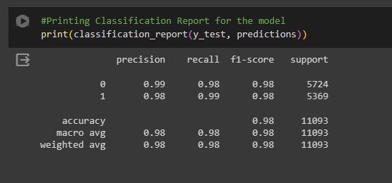
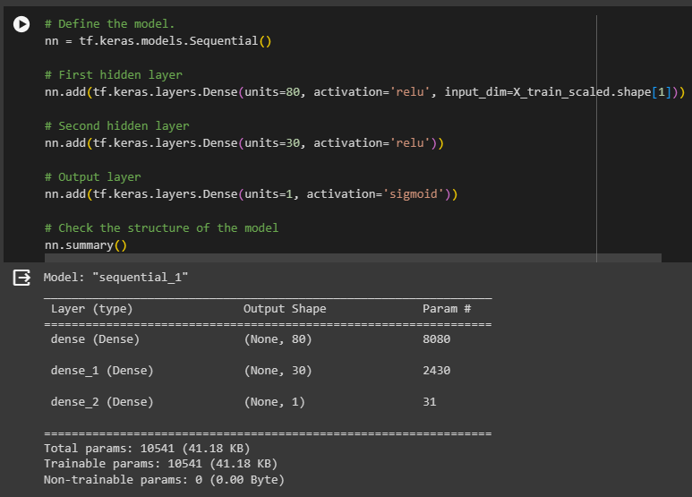
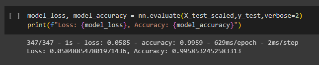

# FInalProject

# Fake_News_Detaction_ML

**Introduction**:
   The age of information has allowed for the mass proliferation of information through the decentralization of media outlets. Now thanks to social media platforms such as youtube, Instagam, facebook, etc people can consume content at an incredibly fast rate. This has left people exposed to false articles that are not necessarily reviewed for their content validity. These stories may be created to trick people with mslicious intent.  It’s important to be careful when reading news online and to check if the story is true before sharing it with others. As a solution we propose to create a Fake News detector tool that allows the user to filter articles to assure what they are consuming comes from a verified source

**Data Source**:
   (https://www.kaggle.com/datasets/rajatkumar30/fake-news)  
   The dataset consists of two CSV files. The first file named Fake.csv and the second file named True.csv. Each article contains the following information:
      * article title (News Headline),
      * text,
      * subject (Type of news)
      * the date the article was published on*

**Process**

1. **Data Cleaning**  :   
   The first step to the development was cleaning the dataset we chose to train our model on. This was split in four steps. Firstly we made all characters lowercase, then we removed urls' that were embedded in the article, then we removed stop characters like is,a,the as these words as fillers didnt offer any insight and finally we lemmatized the words from the articles. This process made it so the articles would be readable by our model and made more accurate as any extra content was minimized.
   Furthermore, we then tokenized out data. We continued cleaning our tokens according to the following parameteres: removing tokens with repeating characters, removing tokens contaning digits, removing tokens including underscore, removing token containing special characters and removing tokens with less than 2 characters. We then saved this data into a new dataframe.

2. **Preprocessing**  :  
   To preprocess our data we first used LabelEncoder function to assign a binary value to True(1) and False(0) and to assign a value to each news type. Then we vectorized our data to assign more weight to repeated words. Then we created out Y and X values. Y values consisted of subject and label columns and X values, vectorized feature names

3. **Training and Logisitic Regression**  :  
   We made performed a logistic regression with our variables an recieved an accuracy score of 98%.
          
          

5. **Deep Learning model**  :  
   For our deep learaning model we first created a standard scaler instance and we fit and scaled our data. We then defined our model and run it.
   We received an accuracy score of 99%    
          
          
          

6. **Model prediction**  :  
          
          
          

# Sources Used:
   For data cleaning : https://www.kaggle.com/code/nityam07/fakenews-detection-using-ml-and-dl

   
   Carleton Bootcamp Activities

